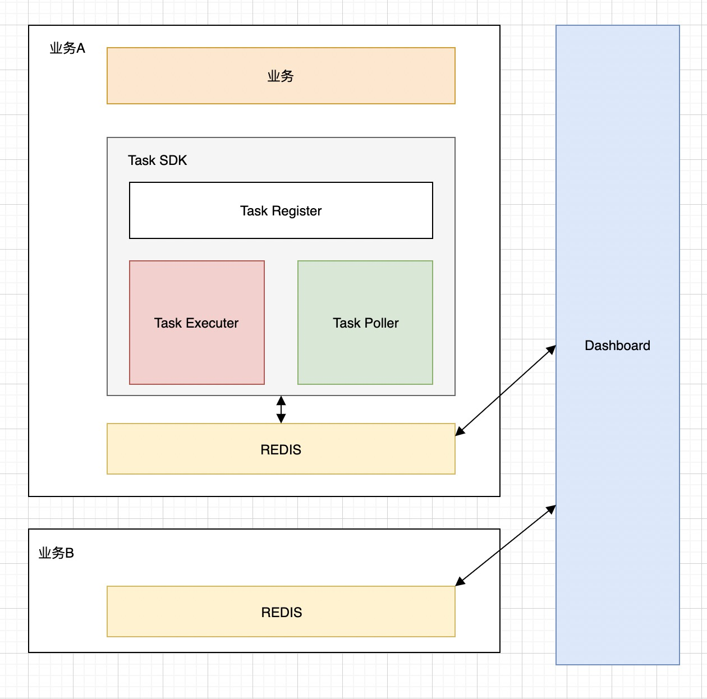
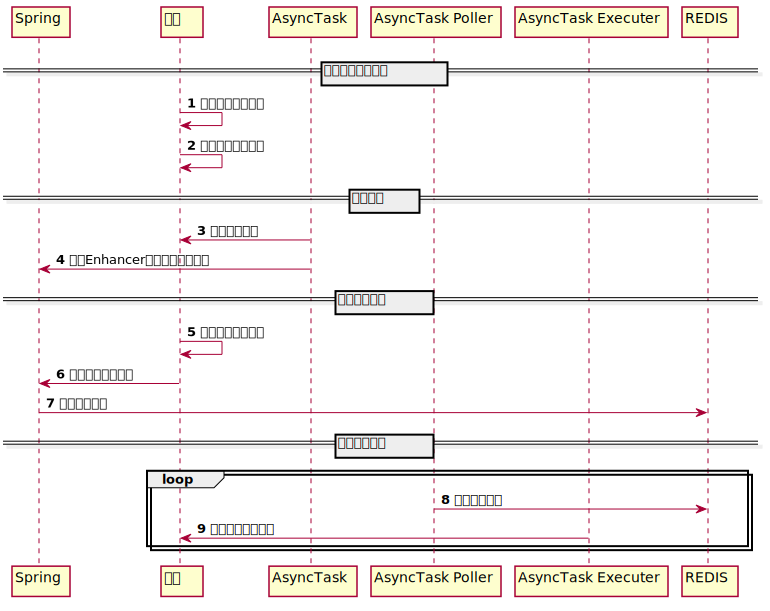

# transaction-async-task-spring-boot-starter
## 系统架构
### 设计原则
 - 业务隔离，业务只处理自己的任务
 - 高性能，高并发
 - 使用简单（简单注解即可）
### 设计思想
通过实现异步任务接口来启用异步任务
starter通过扫描异步任务接口的实现bean进行任务参数校验和任务注册
使用spring的Enhancer将异步任务方法拦截，执行的时候不是直接执行，而是放入redis队列中
轮询redis队列来获取任务执行列表，进行回调执行
需要事务支持的任务，需要用到spring的事务回调机制
### 架构图

### 任务状态机

### 时序图

